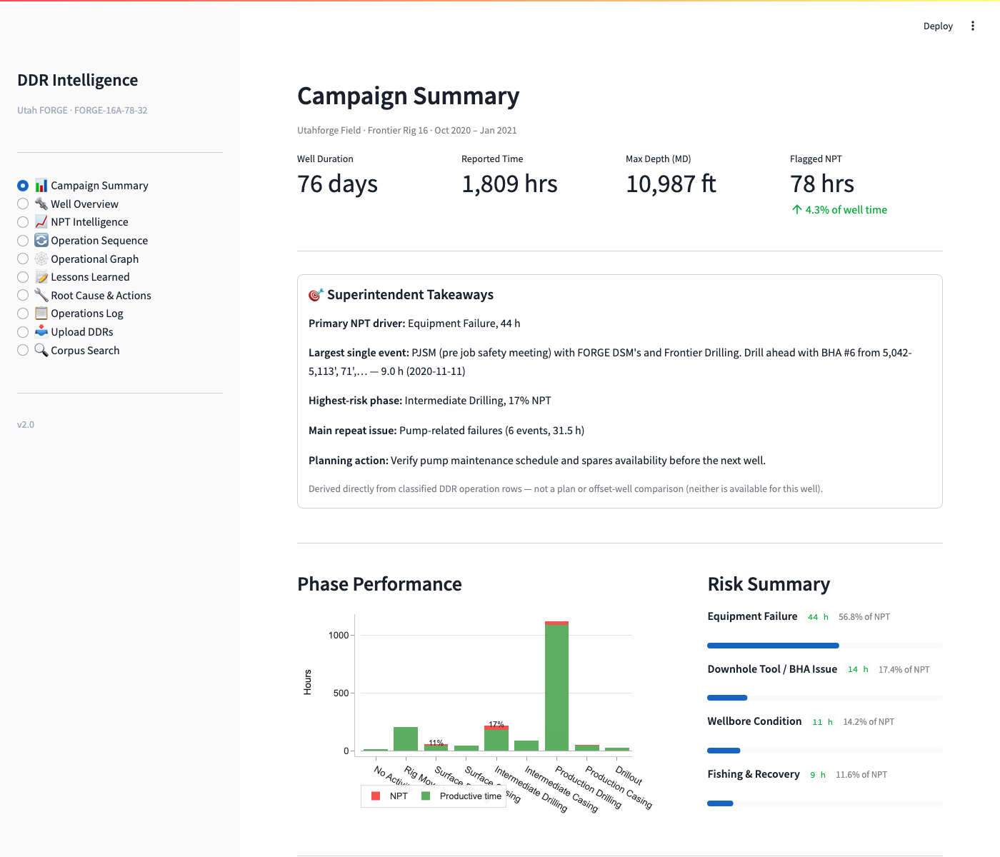
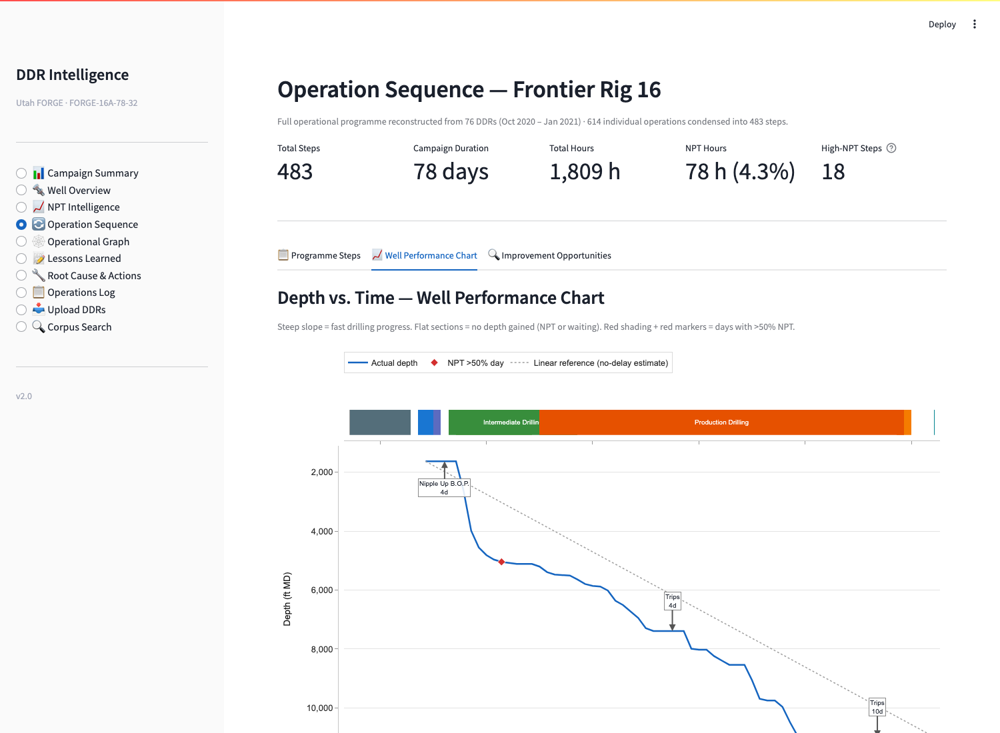
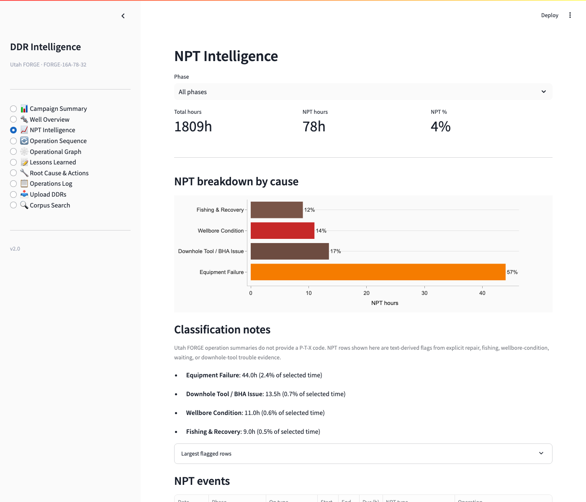
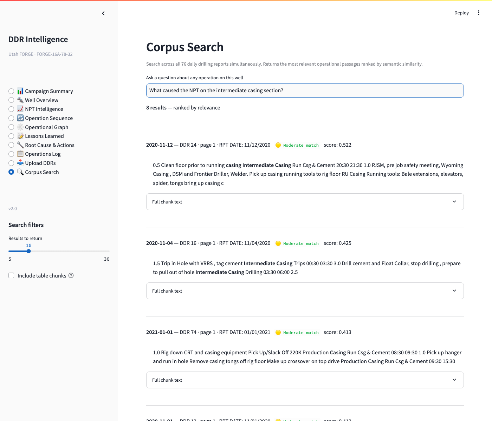
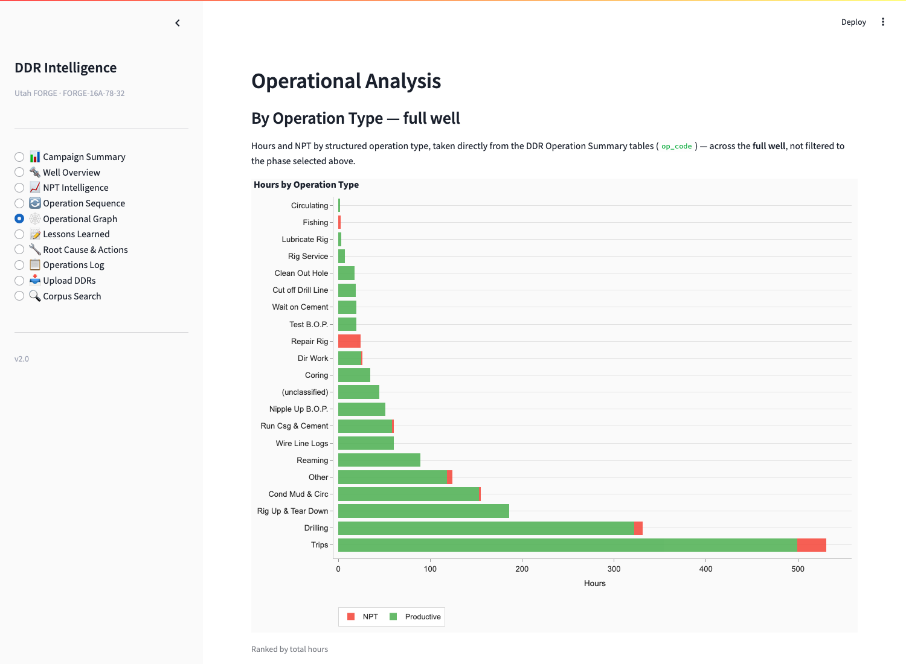
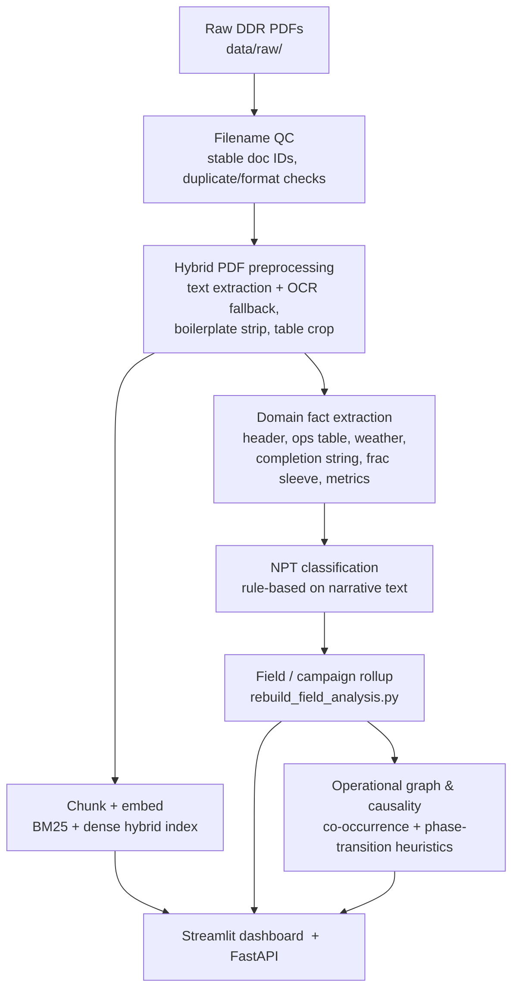

# DDR_UTAH_FORGE

**Version 2.0.0** — see [CHANGELOG.md](CHANGELOG.md) for release history.

**Turns a stack of scanned daily drilling reports (DDRs) into a searchable, structured drilling-performance dashboard.**

Point it at the raw PDF reports for a well, and it extracts the operations table, NPT (non-productive time) events, weather, and completion data from each one, then rolls all of it up into an executive summary, a depth-vs-time performance chart, an NPT root-cause breakdown, and free-text semantic search across every report — no manual DDR reading required.

Built for **Utah FORGE well FORGE-16A-78-32** (Frontier Rig 16, Oct 2020 – Jan 2021, 76 reports). The extraction layer is tuned to this well's specific report template; see [Limitations](#limitations) before trusting it on a different one.

## What it looks like

| Campaign Summary | Well Performance Chart |
|---|---|
|  |  |

| NPT Intelligence | Corpus Search |
|---|---|
|  |  |

<details>
<summary>Operational Graph</summary>


</details>

## Architecture

Two layers: a **report-agnostic PDF pipeline** (`src/rag_pdf/`) that turns any scanned PDF into clean text, tables, and a search index, and a **Utah FORGE-specific domain layer** (`src/ddr_rag/`) built on top of it that knows what a DDR looks like and pulls structured drilling facts out of it.



1. **Filename QC** — validates and normalizes raw PDF filenames into stable document IDs, flagging duplicates and unreadable files.
2. **Hybrid PDF preprocessing** — per page: extract text (PyMuPDF), fall back to OCR only when extraction is too sparse, strip repeated headers/footers, detect sections, chunk for retrieval, and extract tables via anchor-cropped `pdfplumber`.
3. **Search index** — chunks are embedded and combined into a corpus-wide BM25 + dense hybrid index (powers Corpus Search).
4. **Domain fact extraction** — a separate pass that reads each report's text directly and pulls structured facts: header fields, the operations/time table, wellbore events, weather, completion string, frac sleeve status, drilling metrics.
5. **NPT classification** — regex/keyword rules over the operation narrative assign each flagged row an NPT category (equipment, fishing, wellbore condition, weather, …).
6. **Field/campaign rollup** — merges every report's facts into the combined artefacts the dashboard reads.
7. **Operational graph & causality** — a co-occurrence network of operation types plus a phase-transition term-frequency heuristic, surfaced as "carryover"/"escalating" signals.
8. **Serving** — a Streamlit dashboard (`app/ui/`) reads the rolled-up data; a FastAPI service (`app/api/main.py`) exposes health, search, and upload endpoints for the RAG side.

## Limitations

Everything here is derived from the DDR PDFs themselves — there's no rig sensor feed, no offset-well data, and no drilling plan behind it. That shapes what the numbers can and can't tell you:

- **NPT and its cause are inferred from free-text narrative, not a structured code.** Utah FORGE DDRs don't carry a P-T-X trouble code, so `src/ddr_rag/npt_classifier.py` flags NPT and assigns a cause purely by matching phrases in the operator's write-up (the app says this explicitly on the NPT Intelligence page). Non-standard phrasing can be missed or miscategorized.
- **Every extractor is pattern-matched against this well's specific report template.** Wellbore events, weather, completion string, frac sleeve status, and drilling metrics are all pulled with regexes tuned to how *this* report writer phrases things. A DDR that's formatted or worded differently will extract worse, or not at all, until a new profile/extractor is added.
- **No planned-time programme or offset well exists for this campaign.** The "Expected" flat-time classification and the depth chart's "Linear reference" line are structural baselines (op-code driven, or a straight no-delay line), not a comparison to an actual drilling plan — the dashboard is explicit about this wherever it appears.
- **Table extraction (BHA, mud, survey tables) is the most fragile layer.** These come from scanned, ruling-line-heavy page layouts; an earlier extraction backend silently corrupted numeric values (durations off by 10x) before being replaced with the current anchor-cropped approach. Treat table-derived numbers as more error-prone than header/text fields.
- **OCR only runs when primary text extraction comes back nearly empty.** A page that extracts as garbled-but-not-empty text is never OCR-corrected.
- **The operational graph and "causality" signals are frequency heuristics**, not statistically verified causal inference — they flag terms that co-occur or cluster around phase transitions more often than a threshold, nothing more.
- **Each report is parsed independently.** There's no cross-report reconciliation beyond de-duplicating by report date, so an error in one DDR doesn't get caught against its neighbors.

In short: treat this as **structured intelligence extracted from unstructured, scanned reports for one well** — a major time-saver over reading 76 PDFs by hand, but not a substitute for engineering judgment on any individual number.

## Repository layout

```text
app/          Streamlit UI and FastAPI API
configs/      DDR profiles, vocabulary, and project defaults
data/raw/     source Utah FORGE PDF reports
data/processed/
              generated extraction outputs
data/fields/  field/well manifests and combined analysis artefacts
data/graphs/  operational graph and causality outputs (scripts/build_graphs.py, scripts/build_causality.py)
demos/        LinkedIn/marketing demo assets, not part of the production dashboard
docs/         implementation notes
scripts/      command-line pipeline entry points
src/          reusable extraction, retrieval, and analytics code
tests/        focused regression tests
```

## Project Defaults

- Field/project: `UtahForge`
- Wellbore: `FORGE-16A-78-32`
- Raw PDFs: `data/raw/`
- DDR profile: `configs/ddr_profiles/utah_forge.yaml`
- Well manifest: `data/fields/UtahForge/wells/FORGE-16A-78-32/ddr_ids.txt`

The filename QA/QC layer supports the existing Utah FORGE filenames, including compact date pairs such as `11920201192020` and duplicate copy markers such as `reporttmp 2.pdf`. Generated document IDs are stable and unique per source filename.

## Setup

Requires Python >=3.11 (see `pyproject.toml`).

**venv:**

```bash
python -m venv .venv
source .venv/bin/activate
pip install -r requirements.txt
```

**conda:**

```bash
conda create -n ddr-utah-forge python=3.11 -y
conda activate ddr-utah-forge
pip install -r requirements.txt
```

Verify the environment with the repo's preflight check:

```bash
python scripts/check_environment.py --strict
```

## Validate Raw PDFs

```bash
python scripts/qc_raw_ddr_filenames.py --skip-pdf-open-check
```

Outputs are written to `data/processed/qc/`:

- `raw_pdf_manifest.csv`
- `raw_pdf_issues.csv`
- `raw_pdf_missing_reports.csv`
- `raw_pdf_qc_summary.json`

## Run The Pipeline

```bash
python scripts/batch_preprocess_raw_ddrs.py --build-index
python scripts/extract_wellbore_events.py
python scripts/extract_weather.py
python scripts/extract_completion_string.py
python scripts/extract_frac_sleeve_status.py
python scripts/rebuild_field_analysis.py
```

`data/raw/` and `data/processed/` are gitignored - neither the source PDFs nor
the generated outputs are distributed via this repo. Anyone working with this
project needs the raw PDFs placed in `data/raw/` first, then regenerates
`data/processed/` locally with the command above (fast: ~1s/document). To
force a full reprocessing of documents that already have output (e.g. after a
pipeline change like the extraction backend swap in #1), add `--no-resume`.

`--build-index` (or a manual `scripts/build_index.py` run) is what regenerates
each document's `embeddings.npy`/`chunk_meta.parquet` from its `chunks.parquet`.
If you reprocess documents *without* it, those per-document embeddings go
stale relative to the new chunks. `scripts/build_global_index.py` doesn't
detect that staleness - it just concatenates whatever per-document embeddings
and chunk metadata it finds - so running it against stale embeddings silently
produces a `data/global_index/` where the vectors don't correspond to the
chunk text. Always run `scripts/build_index.py` (or `--no-resume --build-index`)
before `scripts/build_global_index.py` after any reprocessing.

## Launch The Dashboard

```bash
bash scripts/run_ddr_intelligence.sh
```

The Streamlit app runs on `http://localhost:8502` by default.

## `src/rag_pdf/` vs `src/ddr_rag/`

Two layers, kept separate on purpose:

- `src/rag_pdf/` is the generic, report-agnostic PDF pipeline: page extraction, OCR fallback, region/table detection, boilerplate stripping, chunking, and the hybrid BM25 + dense search service. It has no notion of "DDR" and would work on any PDF corpus. `scripts/preprocess_hybrid.py` and `scripts/ask_query.py` / `scripts/run_eval.py` drive it directly.
- `src/ddr_rag/` is the Utah FORGE / DDR-specific domain layer built on top of that output: filename QC, DDR header/section parsing, extractor registry, NPT classification, causality analysis, and graph building. `scripts/batch_preprocess_raw_ddrs.py`, `scripts/extract_*.py`, `scripts/build_graphs.py`, and `scripts/build_causality.py` drive it.

They are not merged because `rag_pdf` is meant to stay reusable for a future non-Utah-FORGE corpus; `ddr_rag` is where anything specific to this well's report format belongs.

## Notes

Some reference/demo scripts and docs from `DDR_RAG_Pipeline` are retained because they are useful architecture examples. Treat anything mentioning the original reference corpus, `RigAlpha`, `FieldX`, or `Block-A` as reference material unless it has been explicitly adapted for Utah FORGE.

## License

[MIT](LICENSE).